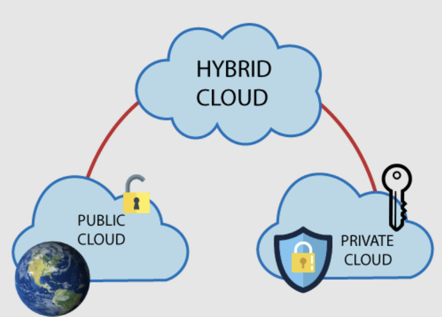

# Zurzbeschreibung Hybrit Cloud

## Was bedeutet Hybrit Cloud?
Eine Hybrid Cloud kombiniert private und öffentliche Clouds, sodass Daten und Anwendungen zwischen ihnen geteilt werden können. Diese Konfiguration bietet Flexibilität und mehr Deployment-Optionen.

## Beispiele
-   Bei der SBB laufen kritische Systeme in einer Private Cloud, während weniger kritische Anwendungen in die Public Cloud ausgelagert sind.

## Grafik
