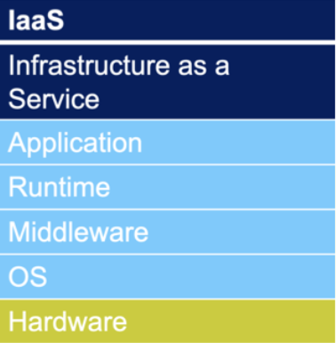

# Zurzbeschreibung IaaS

## Was bedeutet IaaS ausgeschrieben?
IaaS ist eine abkürzung und steht für Infrastrukture as a Service

## Was passiert bei IaaS?
Du bekommst vom Cloud-Anbieter die Grundtechnik, also virtuelle Server, Speicher und Netzwerk. Man muss sich selbst um Betriebssysteme, Anwendungen und Updates kümmern.

## Beispiele
-   Aamzon EC2
-   MS Azure Virtual Machines

## Grafik

## Legende
Durch den Kunden erbrachte Leistung: Blau
Durch den Service-Anbieter erbrachte Leistung: Grün