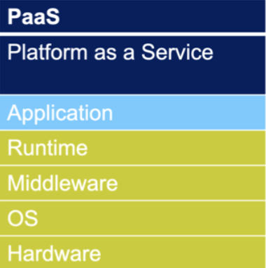

# Zurzbeschreibung PaaS

## Was bedeutet PaaS ausgeschrieben?
PaaS ist eine abkürzung und steht für Plattform as a Service

## Was passiert bei IaaS?
Du bekommst eine fertige Plattform, auf der du Apps entwickeln und betreiben kann. Der Anbieter kümmert sich um Server Updates und Infrastruktur. 

## Beispiele
-   Oracle Cloud Platform (Datenbankmanagement)
-   Mendix (Lowcode-Plattform)

## Grafik

## Legende
Durch den Kunden erbrachte Leistung  
Durch den Service-Anbieter erbrachte Leistung 