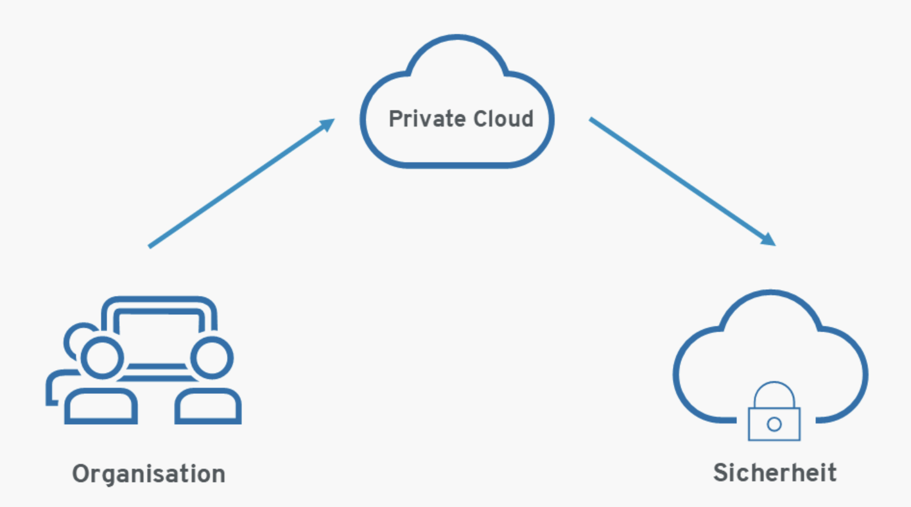

# Zurzbeschreibung Private Cloud

## Was bedeutet Private Cloud?
Eine Private Cloud wird ausschliesslich von einer einzigen Organisation genutzt. Sie kann von der Organisation selbst oder von einem Dritten betrieben und entweder vor Ort (on-premises) oder extern gehostet werden.

## Beispiele
-   Die UBS betreibt eine private Cloud, um sensible Kundendaten zu schützen.

## Grafik
