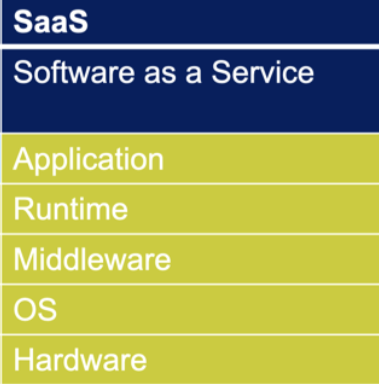

# 📝 Kurzbeschreibung **SaaS**

## Was bedeutet *SaaS* ausgeschrieben?
**SaaS** ist die Abkürzung für ***Software as a Service***.  
Dabei stellt ein Anbieter Software über das Internet zur Verfügung.

---

## Was passiert bei SaaS?
> *„Du nutzt fertige Anwendungen über das Internet, alles wird vom Anbieter verwaltet.  
> Man muss nichts installieren, nur einloggen und loslegen.“*

---

## Beispiele
- **Office 365** (Word, Excel, PowerPoint, OneDrive, Teams)  
- **Google Workspace** (Gmail, Google Drive, Docs, etc.)  

---

## Grafik

---

## Legende
- **Blau** → Durch den Kunden erbrachte Leistung  
- **Grün** → Durch den Service-Anbieter erbrachte Leistung  

## Zusatzinfo
| ✅ Vorteil von SaaS             | ❌ Nachteil von SaaS                  |
|-------------------------------|------------------------------------|
| Keine Installation nötig      | Abhängigkeit vom Internetzugang    |
| Immer aktuelle Software       | Daten liegen beim Anbieter         |
| Skalierbar nach Bedarf        | Weniger Anpassungsmöglichkeiten    |